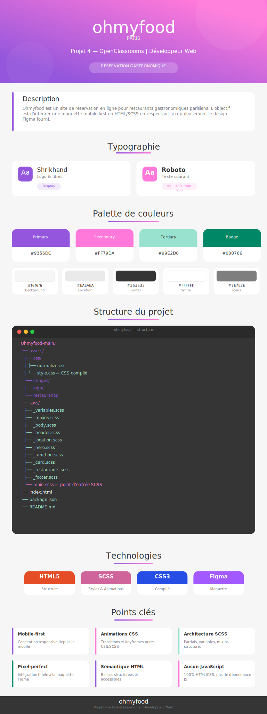

<div align="center">
  
[Site en ligne](https://diurndesign.github.io/Ohmyfood/)

<p align="center">
  
</p>

## Installation

```bash
npm install
```

## Compilation SCSS

Lance le watcher SCSS — il recompile automatiquement à chaque modification :

```bash
npm run sass
```

> Le fichier compilé est généré dans `assets/css/style.css`
